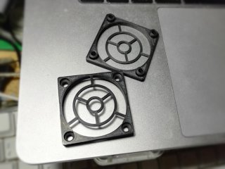

# Lightweight 40mm fan grille
*A simple and light 40mm fan grille to replace the typical metal grilles (formerly thing:1691426)*

### License
[Creative Commons - Attribution](https://creativecommons.org/licenses/by/4.0/)

### Gallery

[🔎](images/Fan40a.jpg) [🔎](images/grillz1.jpg) [🔎](images/grillz2.jpg)

## Description and Instructions

For those who want to shave every gram off their printing head in order to fight ringing, or simply want some new stylish grilles to pimp their printer, here is a compact and low-noise replacement for the popular iron fan grilles.

If you print this in ABS with no infill, no more than 2 shells, and thin extrusions, you can get this to weigh 1.20 grams or maybe even less. The iron grilles on my printer weigh 4.14 g each, so by replacing both, I can shed 5.88 g. That's not much, but every little bit helps to reduce the inertia of the printing head and the wobble when it takes sharp corners.

There are 3 mm thick and a 4 mm thick models. The latter will require slightly more material but it places the grille 1 mm farther from the fan, further reducing noise.

I also offer models that have built-in 3 mm stand-offs. If like on the FlashForge Creator Pro, your fan grilles are mounted with those tiny 3 mm tall rings that always manage to fall and get lost in some nook or cranny of your printer when you disassemble the extruders, then replacing both the grilles and the rings with this single 3D printed grille, will get rid of that problem forever.

As you can see in the third photo, the right fan is mounted with nylon screws. This is because the stepper motor is not mounted, only a dummy placeholder to trigger the endstop. Using nylon screws in this case shaves off another few grams. (Of course I use metal screws when I need to mount the stepper for dual extrusion.)

The starting point for designing this, was a grille generated with [Customizable Fan Grille](https://www.thingiverse.com/thing:188358) by DanielStein.

## Recommended print settings

0.1 mm layers and 0% infill.

The model consists mostly of perimeters and the few ‘solid’ areas are small enough that they can be bridged without infill.

Any material should do because the fans will never get hot since they cool themselves. If minimum weight is your goal however, ABS might be the lightest although we're probably talking fractions of a gram here…

## Updates

### 2016/07/27
First published on Thingiverse.

### 2019/05/19
Added 4 mm models and models with built-in stand-offs.

### 2021/11/02
Migrated to GitHub.

## TAGS
`40mm_fan`,`40mm_fan_cover`,`fan`, `fan_grill`, `fan_grille`, `FFCP`, `lightweight`
